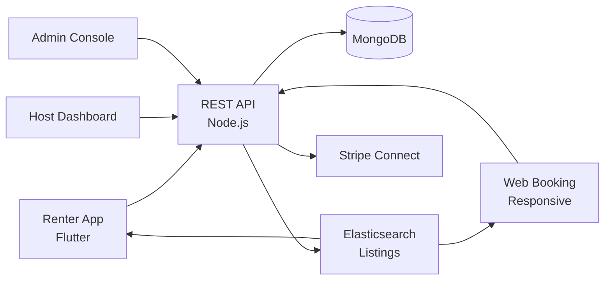

# Turo Clone — White-Label Rental & Booking Marketplace Platform by Miracuves

**MXCar** is a production-ready, white-label Turo clone: a complete peer-to-peer rental platform with renter, host, and admin panels — delivered with **100% source code ownership** in **6 working days**.

> 🚗 **See it running before you talk to anyone.** Live traveler app, host dashboard, and admin console — demo credentials are printed on the [solution page](https://miracuves.com/turo-clone#demo). No sales call required.

---

## 🚀 Live Demos

| Environment | URL | What you can test |
|---|---|---|
| 📱 Renter App | [mas.mimeld.com](https://mas.mimeld.com) | Search, book, unlock, drive, rate |
| 🌐 Web Booking | [mxcar.mimeld.com](https://mxcar.mimeld.com) | Full marketplace in browser |
| 🔑 Host Dashboard | [Solution page → Demo](https://miracuves.com/turo-clone#demo) | Listings, calendar, pricing, payouts |
| 🛠️ Admin Console | [Solution page → Demo](https://miracuves.com/turo-clone#demo) | Hosts, listings, payments, analytics |

Demo credentials for all environments: **[miracuves.com/turo-clone → Demo section](https://miracuves.com/turo-clone/#demo)**

---

## ✨ What Makes This Turo Clone Different

Most rental scripts stop at "list + book." This platform ships with the features that actually run a peer-to-peer rental *business*:

- **Smart Pricing Engine** — nightly prices adjust to demand, season, and local events — same dynamic-pricing algorithm Airbnb patented
- **Verified Identity** — 
- **Multi-Currency + Multi-Language** — government-ID + selfie + driver license verification — production-grade KYC
- **Stripe Connect Payouts** — hosts can invite co-hosts, operations staff, cleaners — each with their own permission level
- **Co-Host Permissions** — hosts get paid in their local currency, with 1099 / tax-handling in 30+ countries

## 📦 Core Features

**Renter:** search & filters · map view · booking · verification · secure payment · reviews · messaging · multi-language

**Host:** listing wizard · calendar management · smart pricing · guest messaging · payouts · analytics

**Admin:** host verification · listing moderation · payment escrow · dispute resolution · analytics

## 🏗️ Architecture

**Stack:** Flutter mobile apps (Android + iOS) · Node.js backend · MongoDB · Stripe Connect · Elasticsearch for listings · Stripe Connect, regional gateways, multi-currency

## 📋 What’s Included

- ✅ Full source code — backend, web, mobile apps, panels (no encryption, no license locks)
- ✅ Deployment to your servers & app store submission assistance
- ✅ Your branding — white-label rename, logo, colors, domain
- ✅ 60 days post-launch support + 12 months of free updates
- ✅ Documentation & handover

**Pricing:** from **$6,699**, transparent on the [solution page](https://miracuves.com/turo-clone/#pricing) — no "contact us for quote" games.

## 🆚 Why Not Build From Scratch?

Custom rental platforms run $80k–$350k and 5–10 months. A proven white-label base gets you to market in 6 working days for a fraction of that, with your budget preserved for host acquisition and demand-side marketing.

## 📚 Resources

- 📖 [Turo Clone — Full Solution Page](https://miracuves.com/turo-clone) (features, pricing, demos, FAQ)
- 💰 [How Much Does a Rental App Cost in 2026?](https://miracuves.com/turo-clone#pricing) pricing breakdown & what's included
- 📝 [Best Turo Clone Script in 2026](https://miracuves.com/turo-clone/blog/) features, pricing & launch guide
- 🧠 [Dynamic Pricing for Rentals](https://miracuves.com/turo-clone/blog/) revenue management, demand
- ✅ [Miracuves Facts & Claims Ledger](https://miracuves.com/turo-clone/facts/) every claim we make, verified

## 🏢 About Miracuves

[Miracuves Solutions](https://miracuves.com) builds white-label clone apps and custom software from Mumbai, India — 90+ ready-made solutions, live demos for every product, transparent pricing, and delivery in 6 working days. Operating since 2010.

**Talk to us:** [WhatsApp](https://wa.me/919830009649) · [Schedule a consultation](https://miracuves.com/schedule-consultation/) · [miracuves.com](https://miracuves.com)

---

### ⚠️ Note on This Repository

This repository is a product overview. The full source code is delivered to clients on purchase — see [what’s included](https://miracuves.com/turo-clone/#included). For a hands-on evaluation, use the live demos above; credentials are public on the solution page.

*Keywords: turo clone, turo clone script, rental marketplace, white label, peer-to-peer rental, Flutter rental app, Node.js rental platform, booking platform*

---

<!--
══════════════════════════════════════════════════
TEMPLATE VARIABLE KEY — auto-generated from Netflix-Clone pattern
══════════════════════════════════════════════════
{APP_NAME}        Turo Clone
{MX_NAME}         MXCar
{CATEGORY}        Rental & Booking Marketplace Platform
{DEMO_WEB}        mxcar.mimeld.com
{PRICE}           $6,699
{SLUG}            turo-clone
{SOLUTION_URL}    https://miracuves.com/turo-clone/
{VERTICAL}        travel_rental_other

See /tmp/verticals/travel_rental_other.txt for the vertical config used to generate this README.
══════════════════════════════════════════════════
-->